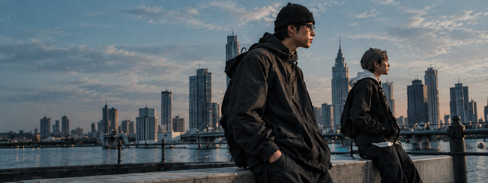

# Marrow

A single-page website for a fictional Manila streetwear label, built as a personal front-end design study.

**Live: _deployed on Vercel — URL pending_**

---

## About

The brief I set myself was to design a streetwear label homepage that doesn't look like a template. That meant committing to a strong art direction — a desaturated, cinematic palette of ink and ivory with steel-blue accents, oversized tracked-out display type, film-grain photography, and editorial section logic — and then building it to production standards rather than stopping at "looks good on my laptop."

So the page is also a working demonstration of the fundamentals: it ships real metadata and structured data, passes an accessibility baseline, keeps its images small, and sets security headers by default.

## Highlights

**Art direction**

- Seven-section single-page flow — hero, featured products, campaign, shop-by-category, brand story, a limited drop, and a newsletter — each with its own layout logic rather than one repeated card grid.
- A single deliberate typeface: **Archivo** for everything, self-hosted and preloaded via `next/font`, with tracking pushed wide on display headings so the voice comes from composition rather than font-mixing.
- Design tokens declared in `@theme` — cinematic ink, warm ivory, studio stone, and a muted steel blue lifted from the city photography — plus an `--ease-editorial` cubic-bezier used by every transition.
- A purpose-built placeholder-art system: every image slot renders the exact geometry, crop and light the final photograph needs, so dropping in a real file later (`src` on `<Photo />`) never moves the layout.
- Film-grain overlay on every frame so the whole page reads as one campaign.
- Custom SVG social icons with official brand paths (Instagram, TikTok, YouTube), filled with `currentColor`.

**Engineering**

| Area | What was done |
|---|---|
| **Performance** | Campaign frame converted from a **1.9 MB PNG to a 141 KB JPEG** with sharp. `next/image` serving AVIF + WebP, explicit `sizes` on every asset, `priority` on the LCP hero, `loading="lazy"` below the fold, and responsive `object-position` crops so a tall mobile frame still lands on the subject. |
| **SEO / AEO / GEO** | Per-page metadata with canonical and Open Graph, `robots.ts` explicitly allowing 14 AI crawlers, `sitemap.ts`, and `llms.txt` so the range, prices and FAQ are machine-readable. |
| **Structured data** | `WebSite` + `Organization` sitewide, plus an `ItemList` of `Product`s on the homepage **generated from the same `FEATURED_PRODUCTS` array the grid renders** — so the schema can't drift from visible content. |
| **Accessibility** | Semantic landmarks, one `<h1>`, skip link, descriptive alt text (empty `alt=""` on decorative images), labelled inputs with `aria-live` status, `aria-expanded` mobile menu, and `prefers-reduced-motion` respected. |
| **Security** | Content-Security-Policy, `X-Content-Type-Options`, `frame-ancestors 'none'`, `Referrer-Policy`, `Permissions-Policy`, and HSTS in production. Framework version header disabled. |
| **Responsive** | Mobile-first, verified from 280 px through 1700 px+. The category rail is exactly **2 cards per screen on mobile** with a custom scrollbar, 3-up from 640 px, and a grid from 768 px — no third-card peek at any width. |
| **Monitoring** | — |

## Tech stack

- **[Next.js 16](https://nextjs.org)** (App Router, Turbopack) — statically prerendered
- **React 19**
- **TypeScript** in strict mode
- **[Tailwind CSS v4](https://tailwindcss.com)** with design tokens declared in `@theme`
- **[lucide-react](https://lucide.dev)** for the icon set

## Getting started

```bash
npm install
npm run dev
```

Open [http://localhost:3000](http://localhost:3000).

```bash
npm run build   # production build (all routes prerender statically)
npm start       # serve the production build
npm run lint    # eslint
```

## Environment

| Variable | Default | Purpose |
|---|---|---|
| `NEXT_PUBLIC_SITE_URL` | `https://marrow.example` | Absolute base URL used for the canonical tag, Open Graph, `sitemap.xml`, `robots.txt` and JSON-LD `@id` values. Set this to override the deployed origin (e.g. a custom domain). |

There are no secrets, APIs, databases or server routes — the site is entirely static.

## Project structure

```
src/
├── app/
│   ├── layout.tsx          # Archivo font, metadata, sitewide WebSite + Organization JSON-LD
│   ├── page.tsx            # homepage composition + Product ItemList JSON-LD
│   ├── globals.css         # Tailwind import, design tokens, base + component styles
│   ├── opengraph-image.tsx # generated Open Graph share image
│   ├── robots.ts           # generated robots.txt (AI crawlers allowed)
│   └── sitemap.ts          # generated sitemap.xml
├── components/
│   ├── SiteHeader.tsx      # fixed header, mobile menu, search/account/cart
│   ├── BrandMark.tsx       # logo lockup, imported as a module so Next fingerprints it
│   ├── icons/SocialIcons.tsx   # official brand paths, filled with currentColor
│   ├── media/Photo.tsx     # next/image wrapper: placeholder art + film grain
│   ├── media/PlaceholderArt.tsx # purpose-built SVG compositions per slot
│   └── sections/           # Hero, FeaturedProducts, Campaign, ShopByCategory,
│                           #   BrandStory, WinterDrop, Newsletter(+Form), SiteFooter
├── assets/logo.png         # brand lockup artwork
└── lib/content.ts          # SITE, nav, categories, products — single source for UI + schema
public/                     # optimized photography, header icons, llms.txt
```

## Assets

The photography is stock placeholder imagery used to demonstrate layout and art direction; the type system, composition, layout logic, and SVG details are original. Image processing was done with [sharp](https://sharp.pixelplumbing.com) — the campaign frame alone dropped from 1.9 MB to 141 KB with no visible quality loss.

## Status

This is a single homepage and is intentionally scoped that way. Still to build: real shop, collection and product routes, an FAQ block (which would unlock `FAQPage` structured data), and a working newsletter backend to replace the demo form.

---

Built by [Jimwel](https://github.com/Jimwel0406).